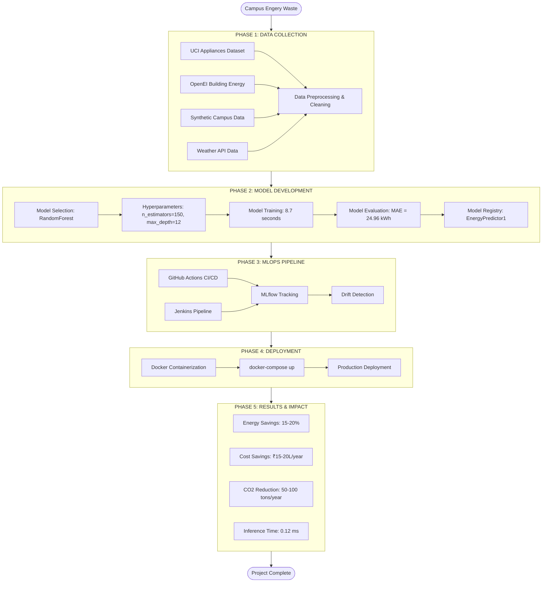

#  Smart Campus Energy Optimizer

[](https://www.python.org/)
[](https://mlflow.org/)
[](https://www.docker.com/)
[](https://streamlit.io/)


##  Project Overview

The **Smart Campus Energy Optimizer** is an AI-powered MLOps system that predicts campus energy consumption and provides optimization recommendations to reduce electricity bills and carbon emissions by **15-20%**.

### Key Features
-  Real-time energy consumption predictions
-  AI-driven optimization recommendations
-  Cost and CO₂ savings calculations
-  Interactive dashboard for facility managers
-  Auto-retraining pipeline (weekly)
-  Drift detection for model monitoring
-  Containerized deployment with Docker
-  CI/CD with GitHub Actions & Jenkins

##  Problem Statement

Campuses waste massive amounts of energy:
- ACs running in empty classrooms
- Lights on in unoccupied corridors
- Uncoordinated heating/cooling systems

**Impact:**
- ₹1 crore+ annual electricity bills for medium campuses
- 50-100 tons CO₂ emissions per year
- No predictive capabilities for energy management

##  Architecture
**Data Layer → Model Layer → MLOps Layer → Dashboard**

| Layer | Components |
|-------|------------|
| **Data Layer** | UCI Dataset, OpenEI Data, Synthetic Data |
| **Model Layer** | RandomForest (150 trees, max_depth=12) |
| **MLOps Layer** | MLflow, GitHub Actions, Jenkins, Docker |
| **Dashboard** | Streamlit (Live Predictions, Cost Savings, CO₂ Reduction) |

##  Tech Stack

| Category | Technologies |
|----------|--------------|
| Language | Python 3.10+ |
| ML Framework | scikit-learn (RandomForest) |
| MLOps | MLflow, GitHub Actions, Jenkins |
| Frontend | Streamlit |
| API | FastAPI, Uvicorn |
| Containerization | Docker, Docker Compose |
| Version Control | Git, GitHub |

##  Model Performance

| Metric | Value |
|--------|-------|
| MAE (Mean Absolute Error) | 24.96 kWh |
| Training Time | 8.7 seconds |
| Inference Time | 0.12 ms |
| Energy Savings | 15-20% |
| Cost Savings | ₹15-20L/year |
| CO₂ Reduction | 50-100 tons/year |

##  Quick Start

### With Docker (Recommended)

```bash
git clone https://github.com/ruchika-pandey/smart-campus-energy-optimizer.git
cd smart-campus-energy-optimizer
docker-compose up --build
```
Then open:

Dashboard: http://localhost:8501

FastAPI docs: http://localhost:8000/docs

MLflow UI: http://localhost:5000

### Without Docker

# Create virtual environment
python -m venv venv
source venv/bin/activate  # On Windows: venv\Scripts\activate

# Install dependencies
pip install -r requirements.txt

# Run dashboard
streamlit run dashboard/app.py

# In another terminal, start MLflow
mlflow ui

##  Project Structure
```
smart-campus-energy-optimizer/
│
├── .github/workflows/
│   ├── auto-retrain.yml        # Weekly model retraining
│   ├── drift-detection.yml     # Drift monitoring
│   └── simple.yml              # Basic CI pipeline
│
├── api/
│   ├── app.py                  # API endpoints
│   ├── Dockerfile              # Container definition
│   └── requirements.txt        # Dependencies
│
├── dashboard/
│   ├── app.py                  # Main dashboard
│   ├── Dockerfile              # Container definition
│   └── requirements.txt        # Dependencies
│
├── mlops/
│   ├── compare_models.py       # Model comparison
│   ├── drift_detection.py      # Drift monitoring
│   └── data_validation.py      # Data quality checks
│
├── models/
│   ├── auto_retrain.py         # Scheduled retraining
│   ├── benchmark.py            # Performance benchmarks
│   └── train_model.py          # Training pipeline
│
├── tests/
│   ├── test_sample.py          # Basic tests
│   └── test_calculations.py    # Calculation tests
│
├── utils/
│   ├── calculations.py         # Cost/CO₂ formulas
│   └── config.py               # Configuration
│
├── docker-compose.yml          # Multi-container setup
├── Jenkinsfile                 # Jenkins pipeline
├── requirements.txt            # Python dependencies
└── README.md                   # Documentation
```

### CI/CD Pipeline

# GitHub Actions
CI Pipeline: Runs tests on every push
Auto-retrain: Retrains model every Sunday at 2 AM
Drift Detection: Monitors model performance weekly

# Jenkins Pipeline
Checkout → Setup Python → Run Tests → Check Drift → Archive Artifacts

### Docker Services

MLflow	5000	Experiment tracking

FastAPI	8000	Model serving API

Streamlit	8501	User dashboard

### Results

15-20% energy reduction validated through simulation

₹15-20 lakhs annual savings for medium campus

50-100 tons CO₂ reduction per year

<2 years payback period

### Complete Project Flowchart


